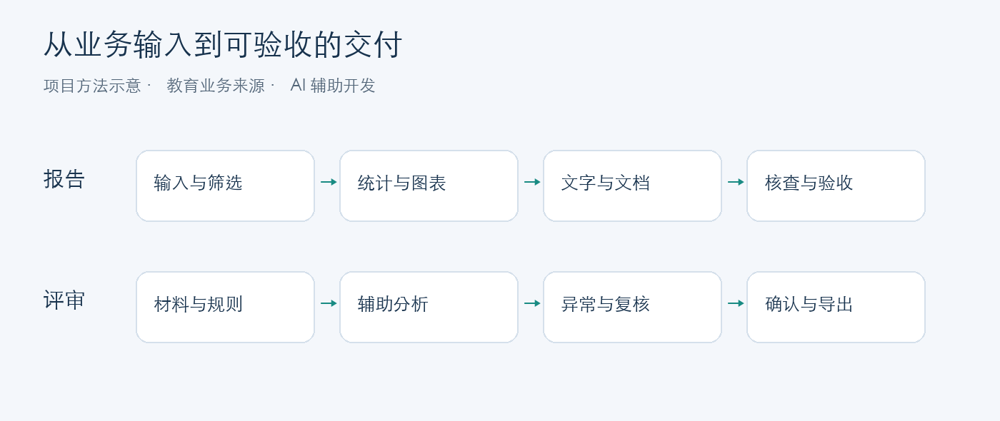

# 企业 AI 应用交付｜项目案例集

将业务规则、AI 辅助处理和人工验收组织成可交付的工作流。

我负责需求与业务规则、AI 辅助开发推进、交付验收及用户培训。两个项目均起于教育业务中的实际工作：报告生产与作品评审。这里用原创说明和全新合成材料展示处理方法，方便快速了解项目。

| 案例 | 30 秒看重点 | 3 分钟看结果 | 深入阅读 |
|---|---|---|---|
| **报告自动化** | 从表格到有依据的报告，保持筛选、分母、图文和验收一致 | [输入、统计、图表与交付示意](report-automation/README.md) | [合成计算脚本](report-automation/demo.py) · [验证结果](report-automation/results.json) |
| **人机协同评审** | 将异常送入复核，保留评分尝试，保护人工确认结果 | [案例卡与状态流程](human-in-the-loop-review/README.md) | [12 个合成案例](human-in-the-loop-review/cases.md) · [机制与证据](human-in-the-loop-review/evidence.md) |

## 与企业应用交付的联系

这组案例可以用于讨论办公文档处理、规则驱动工作流、本地部署验收及非技术用户启用：先确定输入和规则，再组织处理步骤，最后验证结果能否交付和使用。

面向星网锐捷相关集团公司的企业应用岗位，以上能力是交流切入点。实际项目来源为教育业务；尚无向该集团交付、对接其产品或实施 OA/ERP、RAG、信创与多用户部署的经历记录。

## 个人职责与实现方式

- 明确业务对象、统计与评价规则，将要求拆成流程和验收条件。
- 使用 AI 编程工具推进应用实现，结合样例、规则检查与人工复核确认结果。
- 在实际使用中发现规格偏差，组织修正、验收和操作说明。
- 面向业务人员设计培训、演示和使用反馈收集。

## 阅读范围

本仓库是项目案例展示。报告页的小型计算脚本可独立运行；两个原业务系统的完整代码、数据与运行环境不在本仓库中。图示为本次原创示意；报告统计来自本仓库脚本实际执行，评审卡片为本次预设的合成情形。

业务累计规模由项目负责人确认；耗时为使用经验估计。合成演示、软件测试与模型效果分别记录。详见 [来源与验证范围](EVIDENCE.md)。
