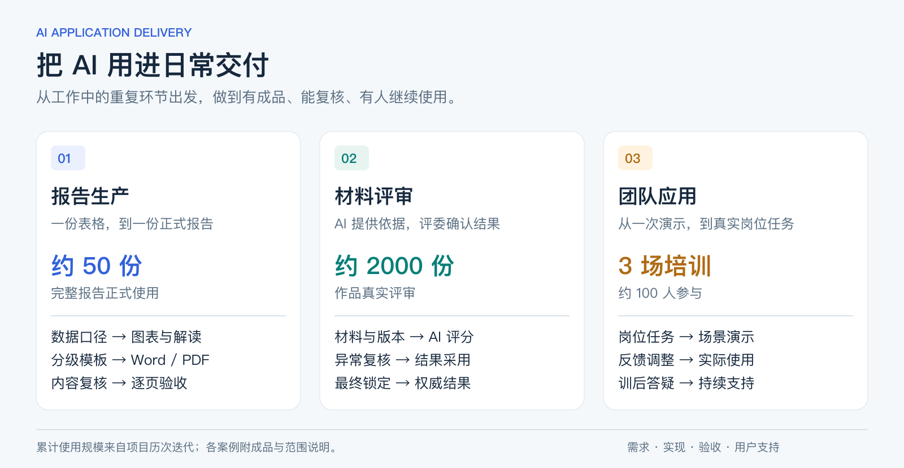

# 把 AI 用进日常交付

我在教育测评工作中做的两个系统，以及帮助同事把 AI 用起来的实践。

做这些项目，起点都很具体：一份报告要反复整理数据、制图和排版；一批作品要收齐材料、逐项评价、反复核对；同事看完工具演示，回到自己的任务又不知道怎么开始。我从这些卡点入手，把业务规则写清楚，借助 AI 编程工具实现，再拿实际交付和使用反馈检验。

## 先看做出来的东西

| 项目 | 解决了什么 | 直接查看 |
|---|---|---|
| **报告自动化** | 将数据、统计、图表、解读和排版串起来，支持市、区、校不同交付要求 | [26页报告](report-automation/sample-report.pdf) · [设计与关键页](report-automation/README.md) |
| **AI 辅助评审** | 集中作品材料与评分依据，让评委复核、采用并确认最终结果 | [完整开源项目](https://github.com/chenbaitao88-ctrl/ai-scoring-system) · [应用与使用反馈](human-in-the-loop-review/README.md) |
| **团队 AI 应用培训** | 从同事的岗位任务出发，帮助他们上手，并继续解决实际使用中的问题 | [培训与训后应用](team-enablement/README.md) |

<table><tr><td width="50%"></td><td width="50%"></td></tr></table>

## 实际用起来怎么样

- **报告：** 历次迭代累计支持约50份完整报告正式使用。单份制作与复核从约5个工作日缩短到2—3小时。
- **评审：** 历次迭代累计用于约2000份作品真实评审，评委会直接复用 AI 评语，把分数作为重要参考。内部评审整体用时节省80%以上，包含材料收集整理、评分和复核，前期重复收集文件的改善尤其明显。
- **培训：** 完成3场培训，约100人参与。之后，相关团队开始用 AI 写复盘报告、辅助出题、分析日常数据和搭建工作流，我也持续解答他们在实际任务中遇到的问题。

用时来自实际工作中的经验估算，未做严格的配对计时；培训后采用情况有使用反馈和求助记录，尚未统计采用率。累计成果来自项目的多次迭代，不能用下面的离线演示代表全部历史使用。

## 我在里面做了什么

我的专业背景是应用统计，日常工作包括测评研究、数据分析和报告交付。我负责这些项目的需求、统计和评价规则、流程设计、AI 辅助开发、业务验收与用户培训。

报告项目让我反复确认一件事：文件能生成，内容未必完整。评审项目则要求把模型建议和人工决定的关系说清楚。培训又把问题带回使用者——流程做出来之后，还得让同事知道拿什么材料、怎么操作、怎么看结果。这三件事构成了我目前最熟悉的 AI 应用交付过程。

**技术：** Python、pandas/SciPy、Matplotlib、LLM API、Quarto/Pandoc；React、TypeScript、FastAPI、SQLAlchemy、SQLite。

## 关于这个仓库

这里整理的是可以公开的成品、界面、流程和操作记录。报告是已产出文件的脱敏副本；评审截图来自应用，使用虚构材料与预置分数，并实际操作了复核、采用、锁定和结果推导。评分系统的完整代码、架构和启动说明已放在 [ai-scoring-system](https://github.com/chenbaitao88-ctrl/ai-scoring-system)；业务原始数据不公开。

[文件来源与验证范围](EVIDENCE.md) · [评审操作记录](human-in-the-loop-review/evidence.md)
