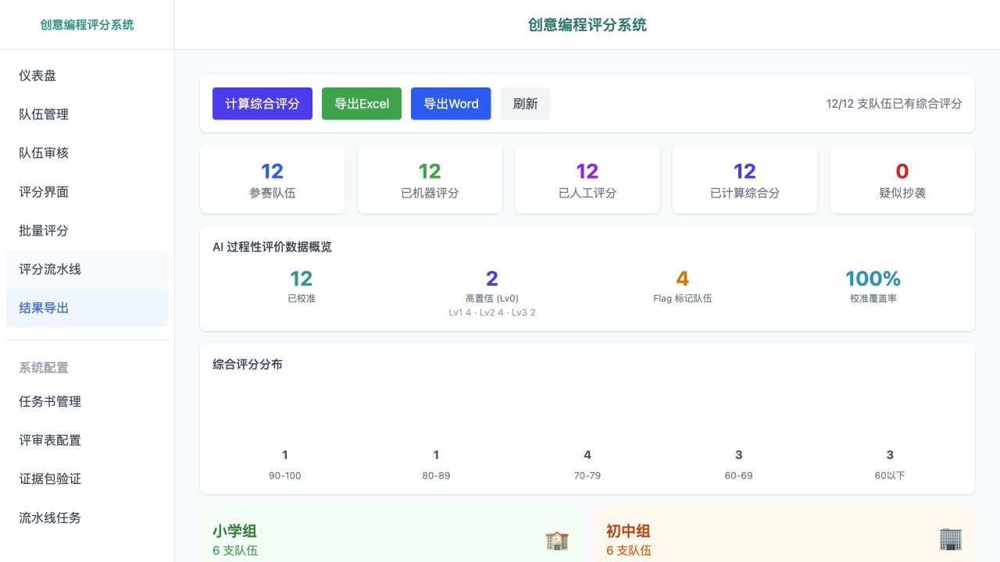

# 企业 AI 应用交付项目

两个来自实际工作的应用：将业务表格转化为测评报告，以及把作品材料、AI 辅助评价与人工评审组织成工作台。

我负责需求与业务规则、AI 辅助开发推进、交付验收和用户培训。报告系统历次迭代累计支持约50份完整报告正式使用，评审系统累计用于约2000份作品评审；累计规模按本人业务回顾记录，当前展示版本不单独承担这些累计结果。

| 项目 | 直接查看成果 | 展示内容 |
|---|---|---|
| **业务报告自动化** | [报告关键页](report-automation/README.md) · [完整26页 PDF](report-automation/sample-report.pdf) | 原系统历史成品的脱敏副本，包含目录、统计图表、章节解读与结论 |
| **人机协同 AI 评审** | [原应用截图与操作记录](human-in-the-loop-review/README.md) · [同案权威结果](human-in-the-loop-review/authoritative-result.md) | 原应用在本机加载合成数据后的真实画面、同案复核、采用、锁定和权威结果 JSON |

<table><tr><td width="50%"></td><td width="50%"></td></tr></table>

报告采用确定性统计、图表生成、LLM 解读和文档验收的分工；评审应用采用 React/TypeScript、FastAPI 和 SQLite，记录材料、评分版本及人工决定。完整业务系统继续保留在私有仓库。

[来源、公开范围与本次验证](EVIDENCE.md)
