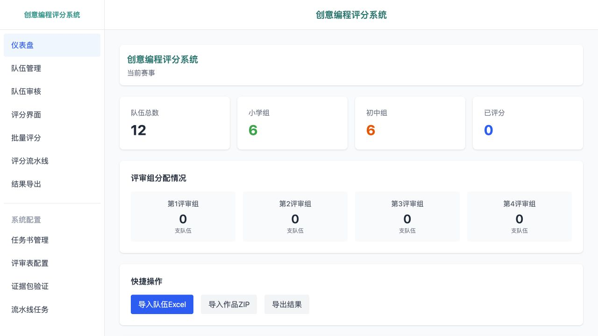
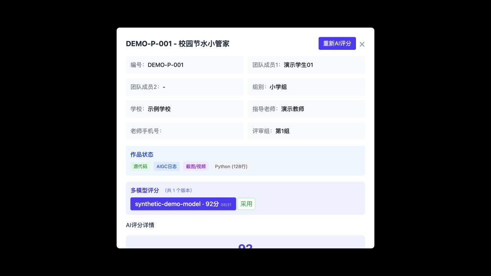
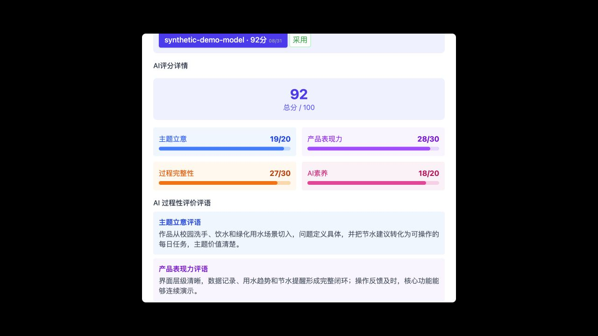
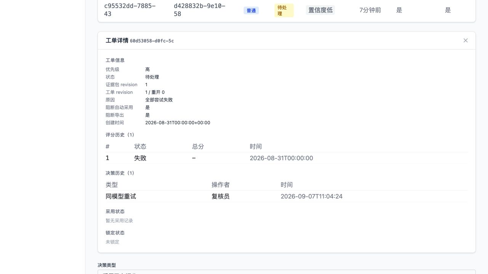
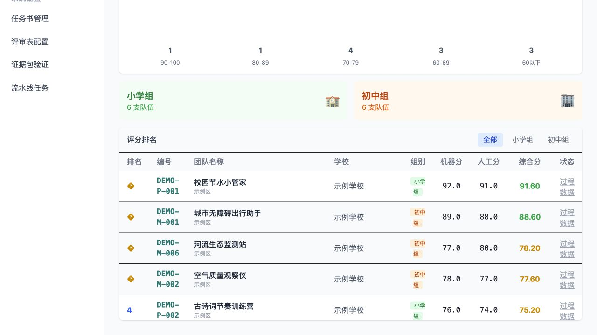

# 规则驱动的人机协同 AI 评审

原应用管理创意编程作品材料、AI 辅助评分、人工复核和结果导出。以下均为原应用在本机启动后直接捕获的画面，以12个虚构案例为基础，并新增一次同案复核运行；分数、评语和初始状态由离线演示预置，本次没有调用评分模型。

**[查看同案权威结果](authoritative-result.md)** · [操作与限制记录](evidence.md) · [返回项目总览](../README.md)

## 应用概览

左侧入口包含材料管理、评分、复核流水线和结果导出。不同模块使用各自的数据表；仪表盘的旧版评分计数与结果页的综合评分计数尚未统一。

## 材料与评分详情

P001“校园节水小管家”的详情页展示源代码、交互记录、截图或视频状态、评分版本及分项结果。这里的材料属性与评价文本为演示预置，页面由原应用实际渲染。

<table><tr><td width="50%"></td><td width="50%"></td></tr></table>

## 同一案例：复核、采用、锁定与权威结果

以 P001 合成材料登记为来源，通过原任务创建器新建评分任务，使用明确预置的92分结果，再通过原任务服务推进到待复核。本次在原界面实际创建采用决定、采用结果并锁定；随后通过原工单服务完成结案。全程没有手改状态文件，也没有调用评分模型。

| 步骤 | 实际结果 |
|---|---|
| 原界面创建采用决定 | HTTP 201；同一工单新增决定 |
| 原界面采用、锁定 | 采用 HTTP 200；锁定 HTTP 201 |
| 锁定但未结案时推导结果 | HTTP 409，未结案阻断仍生效 |
| 原工单服务结案后推导结果 | HTTP 200，权威来源为人工最终锁定，总分92 |

**[查看权威结果 JSON](exports/authoritative-result.json)** · [逐字段摘要表](authoritative-result.md) · [未结案阻断 JSON](exports/unresolved-blocked.json)

这份 JSON 是原权威结果接口的原样响应，绑定同一任务、评分尝试与快照。它不是 Excel，也不是完整成绩批次。创建和阶段推进、结案通过原服务调用完成；采用决定、采用和锁定由原界面完成。页面仍显示工单原始阻断属性，实际导出判定还会检查工单是否未结案；结案后没有删除这些属性。

## 独立演示：失败重试与旧版 Excel

P005 是另一个失败案例，本次原界面实际登记了“同模型重试”决定，但未执行模型重试。M006 的旧锁定状态属于演示预置，与上面的新锁定案例分开记录。

原结果页和[综合评分 Excel](exports/scoring-summary.xlsx)来自旧版综合评分表，包含12条合成记录。该 Excel 是独立文件导出能力，不是上方权威 JSON 闭环的下游。

## 项目工作

我负责材料要求、评价规则、复核与交付流程，借助 AI 编程工具实现前后端，并承担业务验收。系统历次迭代累计用于约2000份作品真实评审，AI 评语被人工评委复用，分数作为重要参考；这一累计规模来自本人业务回顾。

技术包括 React、TypeScript、FastAPI、SQLAlchemy、SQLite 与 LLM API。本轮已在 Apple Silicon 本机完成依赖安装、前端构建、服务启动、浏览器查看、同案采用、锁定、结案、权威 JSON 与独立 Excel 导出；原有失败状态、导出衔接限制与未完成验证集中记录在[证据页](evidence.md)。

补充：[早期独立合成情形](cases.md)，仅用于机制说明。
