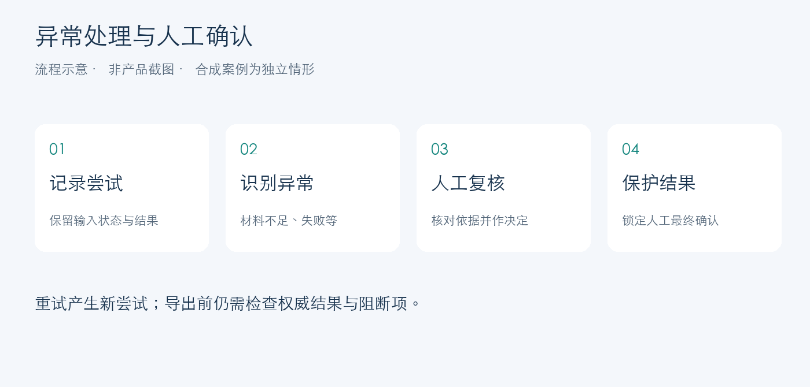

# 人机协同评审｜异常有去向，人工决定有保护

原项目服务于创意编程作品评审。材料接入后，系统组织 AI 辅助分析、异常复核、人工确认和结果导出。项目负责人定义业务规则与流程，借助 AI 编程工具推进实现并负责阶段验收。

本页展示**全新编写的独立合成案例**。文字与分数为人工设定，流程图为原创示意，均未调用模型或启动原产品。

[返回总览](../README.md) · [全部12个案例](cases.md) · [机制与证据](evidence.md)

## 三张案例卡：直接看人如何介入

| 案例卡 | 当前情形 | 处理方式 | 交付状态 |
|---|---|---|---|
| **PUB-R02：说明缺失** | 有作品说明片段，缺少支持某评价维度的材料；预设评语为“请补充实现过程依据” | 标记需要复核，停止自动采用，人员检查材料后决定补充或继续判断 | 等待复核 |
| **PUB-R07：人工已确认** | 预设AI辅助分为72分；人工补看依据后确认75分，并记录“依据补充说明调整” | 保存人工决定并锁定最终结果，后续自动尝试不能直接替换 | 还需检查全部导出条件 |
| **PUB-R10：调用失败** | 示例设定为请求超时，当前尝试未返回有效结果 | 保留失败原因；后续重试新建尝试，已有成功记录保持可追溯 | 等待处理 |

以上为三个独立情形，不构成同一次实际运行轨迹。完整12条表格见 [案例集](cases.md)。

## 为什么这些机制影响交付

- **复核队列**让业务人员看到异常原因与相关材料，明确下一步动作。
- **尝试记录**保留失败与重新执行的过程，方便追溯不同结果。
- **人工锁定**保护已经确认的结论，让自动流程遵守人的最终决定。
- **导出条件**统一检查权威结果与阻断项，避免仅凭“评分完成”进入交付。

在原实现中，开放的 `must_review` 工单阻断自动采用；active `ManualFinalLock` 保护已锁定采用记录；任务管理与结果推导分别维护尝试状态和交付判断。本次静态核对范围与机制说明见 [证据表](evidence.md)。

## 联调案例：查看页面之后还要看请求

历史AI开发协作中，严格浏览器检查发现维度请求返回422：前端使用 current 别名，请求接口要求整数赛事ID。当前前端已先获取当前赛事，再用返回的真实ID获取维度。

本次核对了现有调用顺序。该案例反映接口契约与联调验证，问题发现、修复过程由AI开发协作完成，不归为负责人独立定位的技术成果。

## 证据与使用范围

| 内容 | 来源与状态 |
|---|---|
| 本页及12个案例 | 人工新编合成情形，分数与评语为预设 |
| 状态图 | 原创流程示意，未冒充产品截图 |
| 累计约2000份作品评审 | 负责人确认的历次迭代累计规模，公开包未复点 |
| AI评语被复用、分数作为参考 | 负责人业务反馈，模型准确率与评审一致性未测 |
| 原系统范围 | 单人、本机、单后端实例；完整系统未随本仓库发布 |
| 测试状态 | 本轮静态核对代码机制；原系统pytest因环境缺依赖未启动，未执行浏览器或生产验收 |
| 下一步效果评测 | 先冻结12份授权样本、rubric、Prompt、输入与schema；一个Provider各重复2次，共计划24次调用，尚未执行 |

评测时分别记录人工分歧、调用失败、材料不足和复核事件；成功结果的误差与完整样本的异常比例分别报告。
