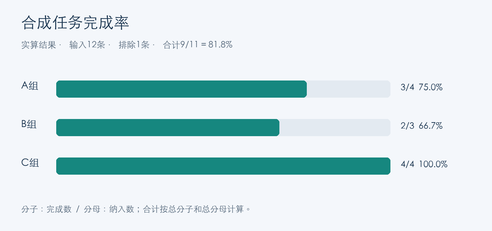
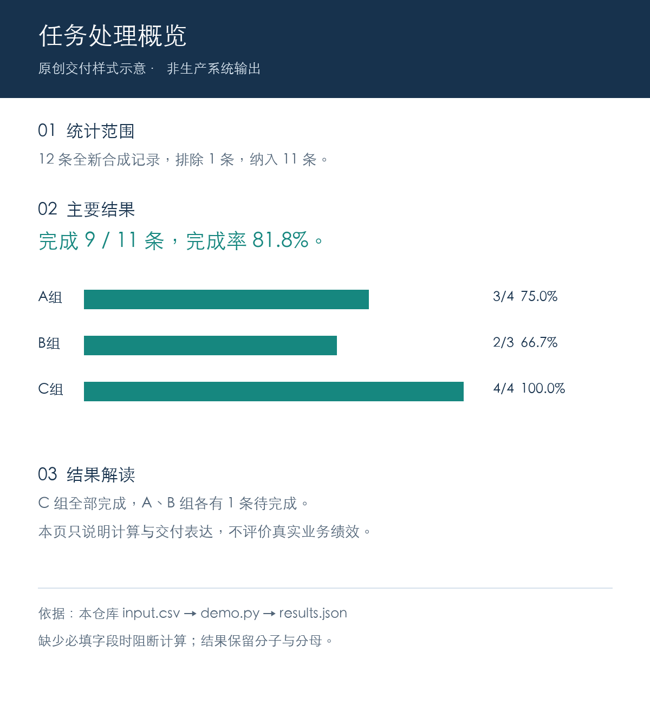

# 报告自动化｜让每个结论都有输入与计算依据

实际项目将 Excel、统计、图表、LLM 解读和 Word/PDF 交付连接起来。这里使用全新编写的 12 条“处理任务”数据，演示输入到结果的核对方式。合成字段和计算脚本为本次原创缩小示例，与原系统生产代码分别维护。

[返回总览](../README.md) · [查看验证范围](../EVIDENCE.md)

## 1. 输入：先确定哪些记录参与计算

[完整输入 CSV](input.csv) 共12条。字段为任务编号、虚构分组A/B/C、是否纳入、完成状态与虚构处理分钟数。分钟数只用于说明字段校验，未参与效率评估。排除 `eligible=no` 的1条后，统计分母为11。

| 字段 | 示例 | 规则 |
|---|---|---|
| case_id | SYN-01 | 非空且唯一 |
| group | A | 虚构分组，必填 |
| eligible | yes | 仅 yes 参与统计 |
| status | complete | complete 或 pending |
| minutes | 11 | 有限且非负的示例数值 |

## 2. 计算：保留分子、分母与筛选结果

以下结果来自 [demo.py](demo.py) 的实际执行，原始输出见 [results.json](results.json)。

| 分组 | 完成数 / 纳入数 | 完成率 |
|---|---|---|
| A | 3 / 4 | 75.0% |
| B | 2 / 3 | 66.7% |
| C | 4 / 4 | 100.0% |
| 合计 | **9 / 11** | **81.8%** |

合计完成率用总完成数除以总纳入数。三个分组的样本量不同，合计按实际分子分母计算。

## 3. 图表：数值与文字引用同一份结果



人工撰写的示例解读：纳入统计的11条记录中，9条已完成。C组4条全部完成，A组和B组各有1条待完成。样例量小，仅展示计算与表达方式。

## 4. 交付：把规则、图表与结论放在同一页



上图是本次重新绘制的交付样式示意，使用本页实算结果。它用于说明报告应保留什么信息；未运行原系统的 LLM、Quarto 或 Windows Word 生产链。

## 5. 错误阻断：字段缺失时停止计算

脚本将首行的 status 字段移除后，实际返回：

```json
{"status": "BLOCKED", "reason": "missing required field"}
```

[6项自动测试](test_demo.py)检查计算、缺字段、空分母、重复编号、非法数值与未知状态。测试已在本次制作中执行；它们仅覆盖此小型脚本。

运行方式（Python 3.10+，无第三方依赖）：

```bash
python3 report-automation/demo.py
python3 -m unittest discover -s report-automation -p test_demo.py -v
```

有 uv 的环境可在以上命令前使用 `uv run --no-project`。结果输出到终端，不修改输入，无模型或网络调用。

## 原项目中的需求纠偏：4 个逻辑图补齐为 10 个

项目负责人回顾：校级报告验收时发现分析被简化为4个逻辑图，要求先审核完整方案，再推进生产。确认10个图号后，借助AI开发工具统一图表、章节解读、模板和检查规则。

完整结构涵盖整体表现（图1—4）、年级与班级比较（图5—7）、证书等级与学习过程分组（图8—10）。10个逻辑图号代表分析主题，拆分物理图仍使用同一图号。该过程体现需求判断与验收责任。

本次曾在私有工作副本核对图义契约和相应测试入口；公开仓库不含当时完整对话或内部实现。上述历史过程按负责人回顾呈现，本页合成脚本单独证明缩小计算示例可运行。

## 证据与使用范围

| 内容 | 来源与状态 |
|---|---|
| 本页12条输入、统计、图表 | 新编合成数据；计算与6项测试本次实际执行 |
| 交付样式 | 本次原创示意，未走原系统生产链 |
| 累计约50份正式报告 | 负责人确认的历次迭代累计业务规模，未在公开包复点 |
| 约5个工作日到2—3小时 | 负责人使用经验估计，包含制作与复核；配对计时尚未实施 |
| 原系统生产依赖 | Windows、Microsoft Word、Quarto与配置好的LLM |
| 原系统历史测试 | 不作为本次测试；当前副本回归受环境依赖阻塞 |
| 模型效果与新行业落地 | 本次未测模型效果；迁移需重定指标、模板与验收 |
