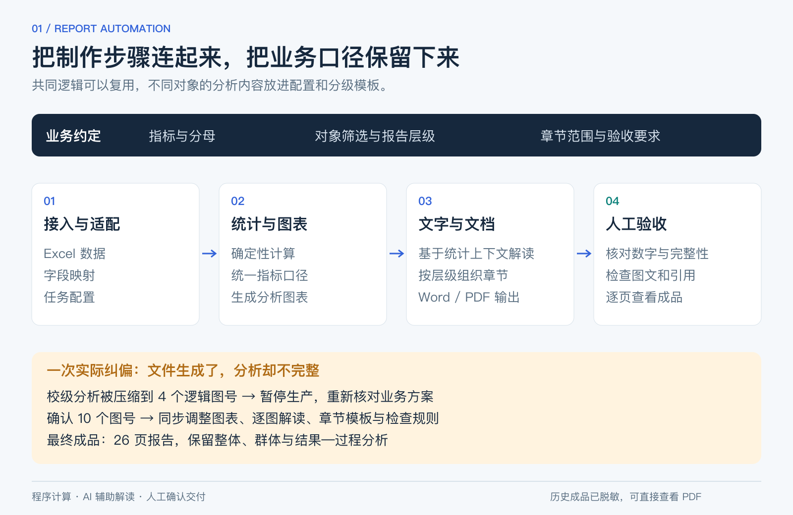

# 把重复的报告制作，变成可以反复交付的流程

一份报告要经历数据整理、统计、制图、解读和排版。服务对象换成市、区或学校，筛选范围、分析内容和模板还会跟着变。过去这些工作分散在多个工具中，反复制作很耗时，也容易让不同章节的口径出现偏差。

我把这条流程连接起来：用程序计算统计结果和生成图表，让 LLM 基于这些结果辅助解读，再按对象生成文档，最后核对内容与成品。

**[查看完整26页报告](sample-report.pdf)** · [返回项目总览](../README.md)

## 做到什么程度

历次迭代累计支持约 **50份完整报告正式使用**。按实际使用经验估算，单份制作与复核从约 **5个工作日缩短到2—3小时**，未做严格配对计时。

下面这份26页报告来自系统的历史成品，公开前处理了品牌和机构标识，保留分析结构、图表、统计数字和分页。完整生产链依赖 Windows Word，这次没有重新运行模型和整套文档生产。

<table><tr><td width="50%"></td><td width="50%"></td></tr></table>

## 数字由程序算，解读跟着统计结果走

Excel 接入后，系统按字段映射、指标和对象筛选规则完成统计，再生成图表。LLM 使用统计上下文辅助文字解读，减少重复撰写；数值口径仍由确定性计算控制。

下面是报告第10页，图表和解读放在一起，读者可以直接对照。这里包含四维能力、学习过程和关联矩阵；横断面差异按样本表现解释，关联不直接写成因果。

## 不同交付对象，不用每次从头重做

我把差异放进字段映射、任务配置和市／区／校分级模板中，让共同计算逻辑可以复用，同时保留不同对象需要的内容。

第15页按班级展开四维比较，第18页呈现等级人数与比例。这些内容对应实际使用者的问题：哪些群体需要关注、结果怎样构成、下一步该看哪里。百分比需要保留人数与分母，不能只为了页面紧凑而省去口径。

<table><tr><td width="50%"></td><td width="50%"></td></tr></table>

## 一次让我停下生产的验收问题

校级报告曾经能够生成，也通过了自动检查，但分析只剩4个逻辑图号。我发现这样会丢掉原方案需要的分析，就要求先停下生产，回到业务方案核对内容。

确认完整范围需要10个图号后，我推动图表、逐图解读、章节模板和检查规则一起调整。最后的成品保留了整体、群体和结果—过程分析；班级图分组展开，因此10个逻辑图号对应13张物理图。

这次经历也影响了后来的验收方式：既检查文件是否生成、关键字段是否正确，也检查该有的分析是否完整，最后逐页看图文、引用和 Word/PDF 的一致性。

## 可以复用什么

这个项目积累的不只是一份报告模板，还有字段映射、任务配置、分级内容结构、运行说明和交付检查。对于需要定期把业务表格转成正式报告的场景，可以沿用这套组织方式。

换领域时，指标定义、统计方法、解读依据和交付模板需要重新确认。我负责这些业务与统计规则，借助 AI 编程工具实现，再承担内容复核和交付验收。

**技术：** Python、pandas/SciPy、Matplotlib、LLM API、Quarto/Pandoc、Word/PDF 自动化。

[完整PDF](sample-report.pdf) · [目录续页](previews/contents-continued.png) · [来源与验证范围](../EVIDENCE.md)

仓库另有一个[小型统计与校验示例](supplemental-demo.md)，方便单独查看输入检查与分母计算。它只是补充示例，不是生成上述报告的完整业务系统。
