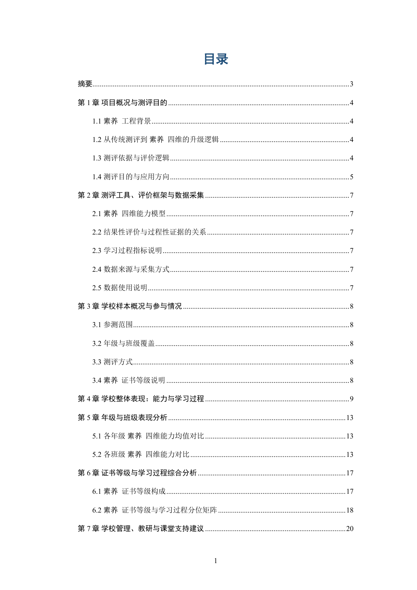
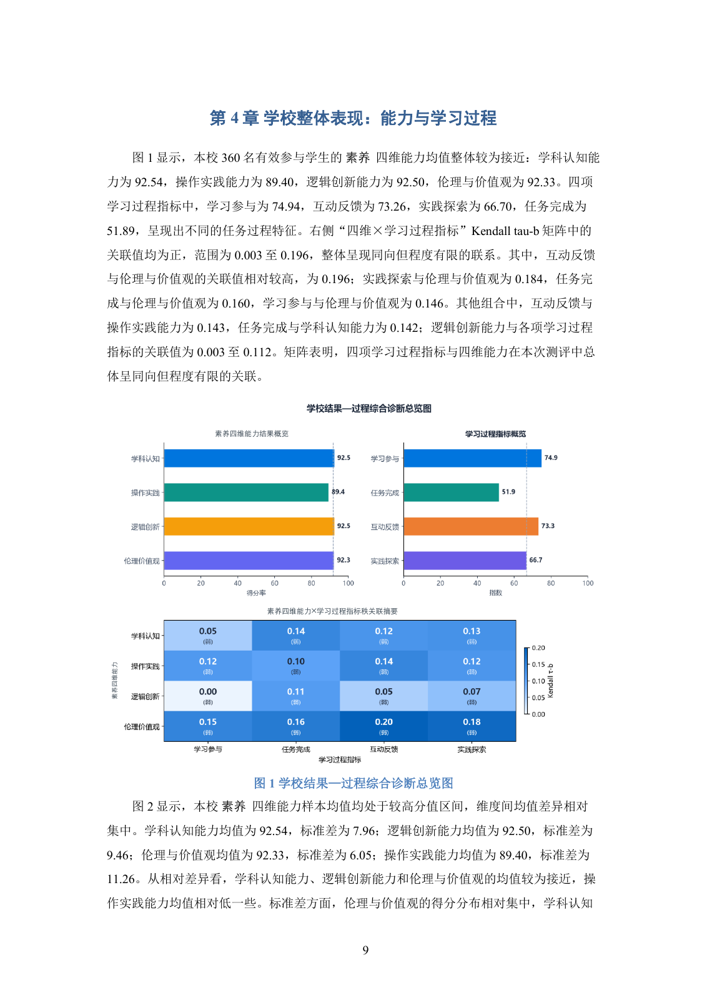
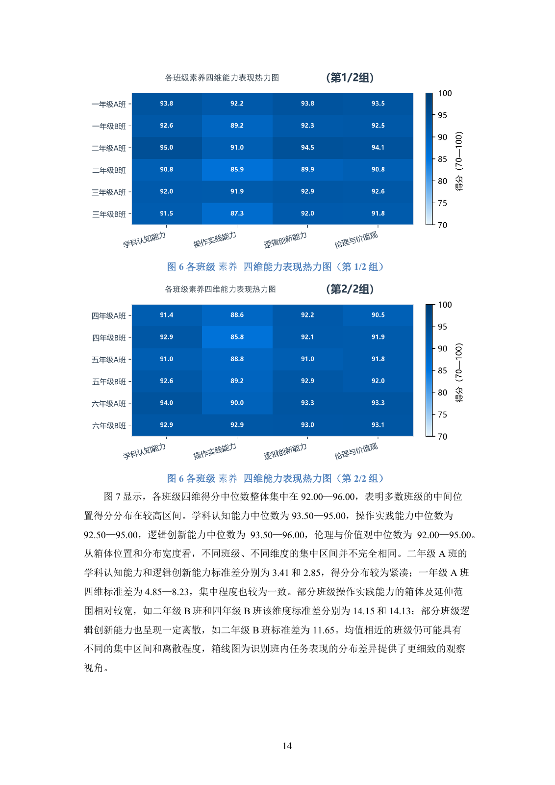
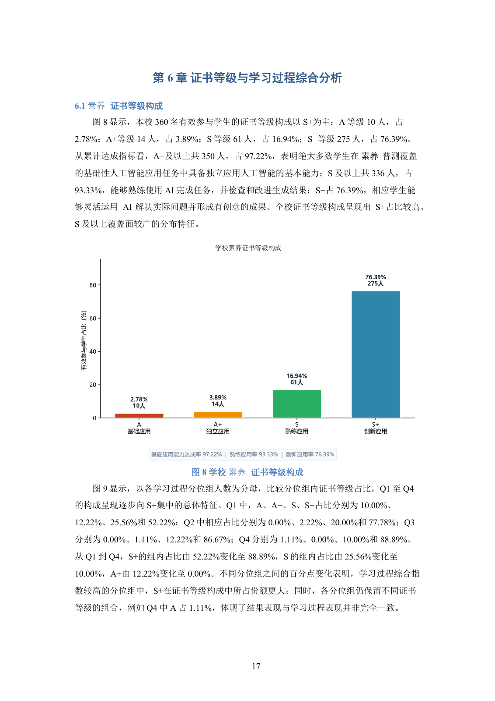
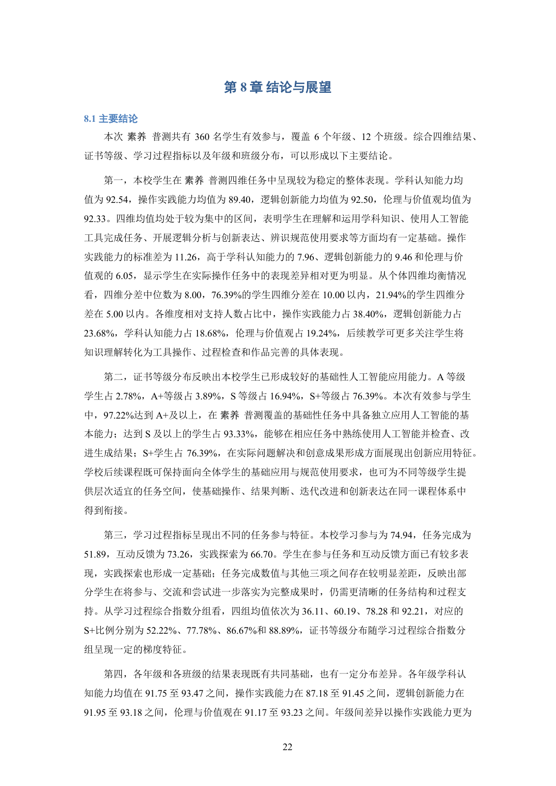

# 业务数据分析与报告自动化

把 Excel 接入、统计、图表、文字解读和 Word/PDF 输出连接起来。下面是原系统已产出的校级报告，按公开要求处理了品牌和机构标识；保留原有分析结构、图表、统计数字与分页。

**[查看完整26页报告 PDF](sample-report.pdf)** · [返回项目总览](../README.md)

## 封面与目录

<table><tr><td width="50%"></td><td width="50%"></td></tr></table>

报告从项目背景、测评工具和样本概况展开，进入学校整体表现、年级与班级比较、等级与学习过程分析，最后给出管理与教学建议、结论和参考依据。[目录续页](previews/contents-continued.png)保留了后半部分结构。

## 统计结果与文字解读

下面是 PDF 第10页。数值、图表和对应解读同页呈现，包含四维能力、学习过程以及二者的关联矩阵。报告中的横断面差异按样本表现解释，关联不自动表述为因果。

## 班级比较与结果构成

PDF 第15页保留了12个班的分组热力图；第18页呈现等级人数、比例和对应说明。整体报告共10个逻辑图号，其中班级图分组展开，形成13张物理图。

<table><tr><td width="50%"></td><td width="50%"></td></tr></table>

## 结论与交付

PDF 第23页汇总主要结论，后续页面给出发展建议和主要依据。完整文件可以直接下载阅读。

## 从需求到验收

项目中，Excel、统计、图表与排版原本分散在多个工具，且市、区、校报告的内容要求不同。我定义指标和对象筛选规则，借助 AI 编程工具推进字段映射、任务配置、分级模板与交付检查。程序计算数值，LLM 根据统计上下文生成解释，最终核对图文、引用和 Word/PDF 一致性。

一次校级验收中，我发现分析被简化为4个逻辑图号，要求先确认完整方案再继续生产。确定10个图号的分析范围后，同步调整图表、章节解读、模板和检查规则。上面的成品保留了补齐后的整体、群体和结果—过程分析结构；纠偏过程按本人回顾记录。

历次迭代累计支持约50份完整报告正式使用。按本人使用经验估计，单份制作与复核由约5个工作日缩短至2—3小时；这一估计未经过配对计时实验。

## 来源与补充材料

本页为历史成品展示，本次未重新调用模型或运行 Windows Word 完整生产链。品牌、机构和关联标准标识已在正文、图片、元数据与链接中脱敏；原报告源文件保持不变。详细范围见[来源与验证](../EVIDENCE.md)。

另保留[小型统计与校验示例](supplemental-demo.md)，用于单独运行输入校验和分母计算；它不承担本页正式报告的成果展示。
