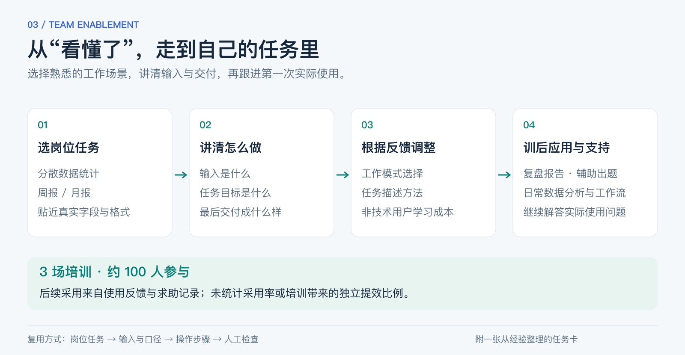

# 让同事把 AI 用到自己的任务里

培训里最常出现的问题，并不是“这个工具还能做什么”，而是“我手里的材料该怎么给它”“这个指令从哪来”“换成我的任务还能不能做”。

我面向教研、赛考和运营团队做了3场 WorkBuddy 培训，约100人参与。准备内容时，我把分散数据统计、周报和月报这些日常任务放在前面，让同事先看到自己的工作，再理解工具的用法。

[返回项目总览](../README.md) · [一张可复用的任务卡](task-card.md)

## 从一份熟悉的材料开始

如果演示数据过于理想，学员很难把操作迁移到自己的工作。我在材料审核时要求模拟数据贴近实际字段和格式，并明确三件事：输入是什么、要完成什么、最后交付成什么样。

这样讲分散数据统计时，重点就不只是展示一个结果，而是让同事知道自己需要准备哪些表、如何描述汇总口径，以及拿到结果后检查什么。周报、月报也沿用这个思路，帮助他们把一个模糊请求拆成能执行的任务。

## 根据第一轮反馈调整讲法

首轮反馈主要集中在工作模式、任务描述和学习成本。后续面向非技术运营人员时，我调整了案例顺序和讲解重点，把个人实践整理成场景演示和操作说明。

我希望同事能从“看过一次”走到“知道自己的任务从哪里开始”。这也是为什么培训内容需要跟着岗位和材料变化，不能只复用一套功能介绍。

## 培训之后，继续跟着真实任务走

培训后，相关团队开始把 AI 用到这些工作中：

| 岗位任务 | 后续采用情况 |
|---|---|
| 业务复盘 | 用 AI 辅助整理和撰写复盘报告 |
| 教研备课 | 用 AI 辅助出题 |
| 日常运营 | 分析日常数据，尝试搭建相关工作流 |

这些应用过程中都有同事继续来问具体问题，我也做了解答。对我来说，训后支持很重要：演示环境里的操作，只有经过真实材料和具体要求的检验，才会变成同事能继续使用的方法。

这里的采用情况来自实际使用反馈与求助记录。我没有统计覆盖率，也没有把所有后续提效都归因于培训；内部聊天和业务材料不公开。

## 留下一份能继续用的方法

我把这次经验整理成了[任务卡](task-card.md)：先写清使用者与交付物，再确认输入、口径、操作步骤和人工检查，最后记录第一次真实使用遇到的问题。它是现在提炼的复用材料，不是历史课件原件。

换到其他团队时，可以沿用这个组织方式；任务、数据和验收标准仍要重新确认。培训的价值也应继续看后续任务是否被采用、结果是否可用，以及哪些问题需要回到工具或流程里解决。
